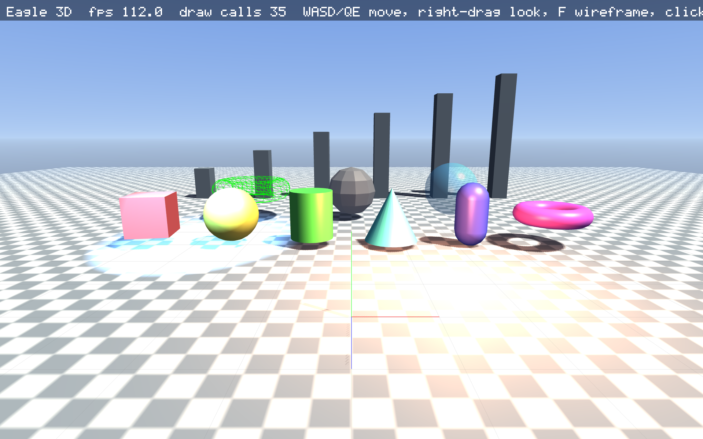

# Eagle

A Crystal-native 2D/3D game engine: library, engine and viewer in one shard,
compiling to a single executable. Inspired by LÖVE (immediate-mode drawing,
`load/update/draw`) and Godot (scene tree, nodes, signals, action map).

Only two native dependencies: **SDL2** and the platform's **OpenGL 3.3**.
Everything else (PNG/QOI/BMP/WAV codecs, TrueType fonts, audio mixer,
physics, particles, UI, 3D renderer with shadows) is written in Crystal.



See it running in the browser, along with every other example, at
[joeyrobert.github.io/eagle.cr](https://joeyrobert.github.io/eagle.cr/).

```crystal
require "eagle"
include Eagle

class Game < App
  @player = Sprite2D.new(Texture.new(Image.circle(32, Color::YELLOW)), Window.center)

  def load
    Input.map "left", Key::A, Key::Left, Input.axis(GamepadAxis::LeftX, -1)
    Input.map "right", Key::D, Key::Right, Input.axis(GamepadAxis::LeftX, 1)
    SceneTree.root.add(@player)
  end

  def update(dt : Float32)
    @player.x += Input.axis("left", "right") * 250 * dt
  end

  def draw(g : Graphics)
    g.print("Hello, Eagle!", 10, 10)
  end
end

Eagle.run(Game, title: "My Game", width: 960, height: 540)
```

## Features

| Area | What you get |
|------|--------------|
| Core | `App` callbacks, fixed + variable timestep, `Clock`, logging, headless/screenshot runs for CI |
| Scene tree | `Node`, `Node2D`, `Node3D`, `SceneTree`, groups, deferred calls, pause modes, `signal` macro |
| 2D | Batched `Graphics` (sprites, shapes, thick lines, concave polygons, text), `Camera2D`, `CanvasLayer`, `Canvas` render targets, blend modes, scissor, custom shaders (LÖVE-style `effect`) |
| Nodes | `Sprite2D`, `AnimatedSprite2D`, `Label`, `Timer`, `TileMap`, `Polygon2D`, `Line2D`, `Particles2D`, `AudioPlayer(2D/3D)` |
| Input | Keyboard, mouse, gamepads (SDL GameController), action map with analog strengths, text input |
| Audio | Float32 mixer, WAV + Ogg Vorbis (Crystal decoder), procedural tones, voices with pitch/pan/fade, buses, streams, 3D spatial audio (distance models, ITD, head shadow, doppler) |
| Physics 2D | Circles/boxes/polygons, SAT, impulse solver, spatial hash, raycasts, layers, sensors, `RigidBody2D`, `StaticBody2D`, `KinematicBody2D` (`move_and_slide`), `Area2D`, `RayCast2D` |
| Physics 3D | Spheres and oriented boxes, SAT manifolds, impulse solver, raycasts, `RigidBody3D`, `StaticBody3D`, `KinematicBody3D`, `Area3D`, `RayCast3D` |
| Web | `wasm32-wasi` build with a WebGL2/WebAudio/DOM runtime (`web/eagle.js`); every example runs in the browser |
| Export | Single executable with compile-time embedded assets, web bundle, macOS app |
| Fonts | Built-in pixel font, TrueType parser + anti-aliased rasteriser, glyph atlases, kerning |
| UI | `Control`, `Panel`, `Label`, `Button`, `CheckBox`, `Slider`, `ProgressBar`, `TextInput`, `VBox`/`HBox`/`GridContainer`, themes, focus & keyboard navigation |
| 3D | `Mesh` primitives + OBJ, `Material` (Blinn-Phong, textures, transparency, wireframe, custom shaders), `Camera3D`, directional/point/spot lights, PCF shadow maps, procedural sky, fog |
| Tween | `Tween.to/value/after/sequence` with 17 easings |
| Algorithms | Seeded PCG32 `Rng` and dice, Perlin/simplex/fBm/Worley noise, grid FOV and A*, Poisson/BSP/caves/mazes, geometry, quadtrees, steering and behavior trees |
| Tools | `eagle init/run/build/export/view/examples` CLI with a project wizard; viewers for images, OBJ, TTF, WAV, GLSL (hot reload) |

## Install

Eagle needs [Crystal](https://crystal-lang.org/install/) 1.21 or newer and SDL2.
The installer checks for both, tells you the exact command to install anything
missing, and installs the `eagle` CLI into `~/.eagle/bin`.

**macOS and Linux:**

```sh
curl -fsSL https://raw.githubusercontent.com/joeyrobert/eagle.cr/main/install.sh | sh
```

Use `wget -qO- ... | sh` if you don't have curl. Pass options after `sh -s --`:
`--with-deps` installs Crystal and SDL2 for you (Homebrew, apt, dnf or pacman; sudo on
Linux), `--from-source` builds from a git clone instead of downloading a release,
`--version v0.1.0` pins a release (or set `EAGLE_VERSION`), and `--uninstall` removes it.
Set `EAGLE_HOME` to install somewhere other than `~/.eagle`.

**Windows (PowerShell):**

```powershell
irm https://raw.githubusercontent.com/joeyrobert/eagle.cr/main/install.ps1 | iex
```

This installs `eagle.exe` and `SDL2.dll` into `%LOCALAPPDATA%\eagle` and adds it to your
PATH. There is also a regular installer, `eagle-setup.exe`, on the
[releases page](https://github.com/joeyrobert/eagle.cr/releases).

## Start a game

```sh
eagle init mygame        # asks for a template, window size, pixel art, web export, git, CI
cd mygame
eagle run                # installs shards on first run, then builds and runs
```

`eagle init` asks its questions in a terminal. Every answer has a flag, so it can be
scripted: `eagle init mygame --template 2d --size 1280x720 --pixel-art --yes`. Templates
are `2d-game`, `3d-game`, `ui-app` and `empty`; each comes with a sample spec. See
`eagle help init` for every flag. `eagle new mygame` is the same as `eagle init mygame --yes`.

A new project looks like this:

```
mygame/
  shard.yml               eagle as a dependency (github: joeyrobert/eagle.cr)
  src/main.cr             entry point: Eagle.run(Mygame::Game, ...)
  src/mygame.cr           the game
  spec/                   crystal spec
  assets/icon.png         placeholder sprite, loaded with res://icon.png
  README.md, .gitignore   and .github/workflows/ci.yml if you chose CI
```

## Manual setup

To add Eagle to an existing Crystal project without the CLI:

1. Install SDL2:
   * macOS: `brew install sdl2`
   * Debian/Ubuntu: `sudo apt install libsdl2-dev`
   * Fedora: `sudo dnf install SDL2-devel`
   * Arch: `sudo pacman -S sdl2`
   * Windows: download `SDL2-devel-2.x.x-VC.zip` from
     [libsdl-org/SDL releases](https://github.com/libsdl-org/SDL/releases), pass
     `--link-flags "/LIBPATH:C:\path\to\SDL2\lib\x64"` when building, and put `SDL2.dll`
     next to your executable.
2. Add the dependency to `shard.yml` and install it:

   ```yaml
   dependencies:
     eagle:
       github: joeyrobert/eagle.cr
   ```

   ```sh
   shards install
   ```

3. Write `src/main.cr`:

   ```crystal
   require "eagle"
   include Eagle

   class Game < App
     def draw(g : Graphics)
       g.print("Hello, Eagle!", 10, 10)
     end
   end

   Eagle.run(Game, title: "My Game", width: 960, height: 540)
   ```

4. Run and build it with plain Crystal, or with the eagle CLI:

   ```sh
   crystal run src/main.cr                          # or: eagle run
   mkdir -p bin && crystal build src/main.cr --release -o bin/game  # or: eagle build
   ```

## Build and export

| Command | Output |
|---------|--------|
| `eagle run [FILE]` | debug build in `bin/`, then runs it (default FILE: `src/main.cr`) |
| `eagle build [FILE]` | release executable `bin/<project>` |
| `eagle export exe [FILE]` | release executable `dist/<project>/<project>` |
| `eagle export web [FILE]` | `dist/web/<project>/`: `index.html`, `eagle.js`, `<project>.wasm` |
| `eagle export app [FILE]` | macOS app bundle `dist/<project>.app` |
| `mkdir -p bin && crystal build src/main.cr --release -o bin/game` | the same as `eagle build`, without the CLI (crystal doesn't create `bin/`) |
| `shards build --release` | builds every target in `shard.yml` into `bin/` |

`<project>` is the project folder's name. Executables look for assets in `assets/` next
to them or in the working directory; add `Eagle.embed_assets("assets")` to `src/main.cr`
(projects from `eagle init` do, unless you pass `--no-web`) to bake them in and ship a
single file. Web builds need that, plus `lld` (`brew install lld`, `apt install lld`);
Crystal's wasm libraries are downloaded on first use. Serve the web folder over HTTP,
for example `cd dist/web/mygame && python3 -m http.server`. Without the CLI, the web build
is `sh lib/eagle/script/build-web.sh src/main.cr dist/web/mygame`.

For automated runs (CI, screenshots), any Eagle program honours
`EAGLE_FRAMES=60 EAGLE_SCREENSHOT=shot.png EAGLE_HEADLESS=1`.

## Working on Eagle itself

```sh
git clone https://github.com/joeyrobert/eagle.cr && cd eagle.cr
shards build                 # builds bin/eagle
bin/eagle examples           # list examples
bin/eagle examples asteroids # run one
cd .. && eagle.cr/bin/eagle init mygame --local eagle.cr --yes   # a game that uses this checkout
```

## Examples

`examples/` contains complete, self-contained programs (no external assets):

* **Games (2D):** `chess` (full rules + alpha-beta AI), `checkers` (1 or 2 players, AI), `breakout`, `asteroids`, `platformer`, `snake`, `roguelike`
* **Games (3D):** `coinrush3d`, `joyride` (an infinite streamed city/countryside driving game with traffic, police, pedestrians and missions), `fps` (Neon Bastion: mouse-look arena shooter with two weapons, grunt/charger AI, Waves and Deathmatch), `voxel` (noise island you walk, break and paint from a colour palette)
* **Feature tests:** `smoke`, `sandbox2d`, `physics`, `physics3d`, `ui`, `interactions`, `touch` (multi-touch, drag, pinch/rotate, virtual joystick), `embedded`, `flythrough3d`, `spatial_audio3d`, `algorithms` (A*, noise, Poisson disk, flocking, FOV)

Every example supports `EAGLE_FRAMES=60 EAGLE_SCREENSHOT=out.png` for automated verification.

## Exporting the examples

```sh
bin/eagle export web examples/breakout/main.cr    # WebAssembly + WebGL2 bundle in dist/web/breakout/
bin/eagle export exe examples/breakout/main.cr    # single release executable (embed assets with Eagle.embed_assets)
bin/eagle export app examples/breakout/main.cr    # macOS .app
script/build-site.sh                              # marketing + docs site with every example playable in the browser
```

Releases: pushing a `v*` tag runs `.github/workflows/release.yml`, which builds the CLI for Linux, macOS and Windows (tarballs, zip and `eagle-setup.exe`) and attaches them to the GitHub release that the installers download from.

## Testing

```sh
crystal spec                 # ~230 specs incl. GPU-backed pixel tests (hidden window)
EAGLE_NO_GPU=1 crystal spec  # skip GPU specs (CI without a display)
```

## Documentation

* `docs/guide.md`: concepts and API tour
* `docs/plans/`: architecture, roadmap, findings
* `crystal docs`: API reference

## License

Eagle is licensed under the GNU Lesser General Public License v3.0 or later.
See `COPYING.LESSER` and `COPYING` for the full text.
